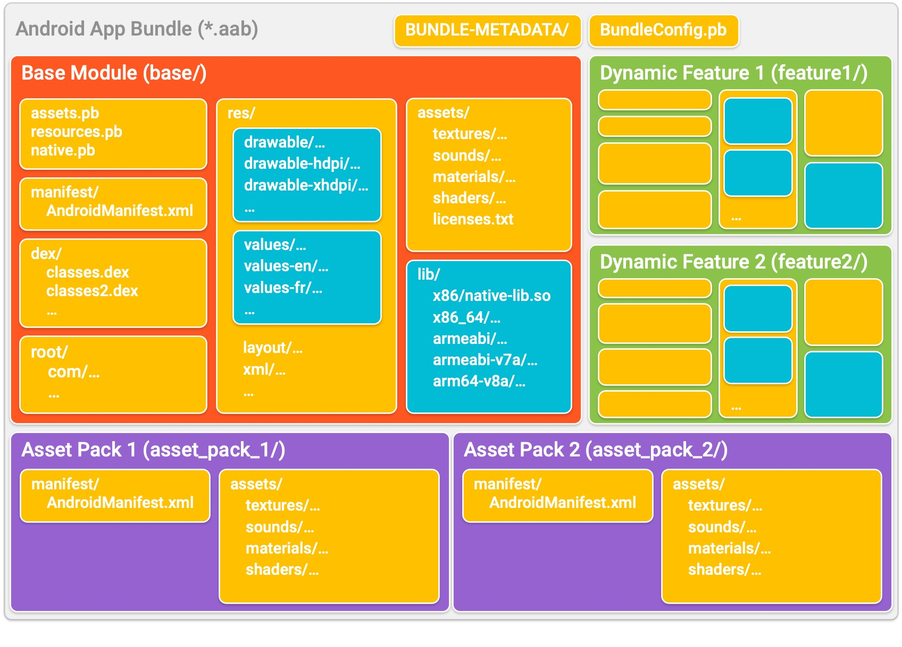
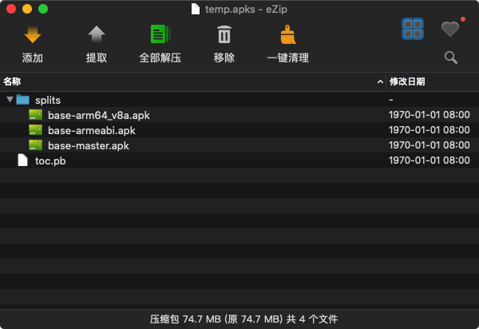
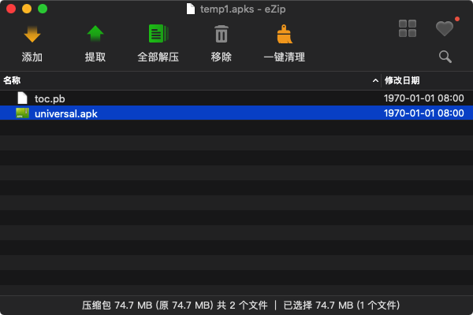
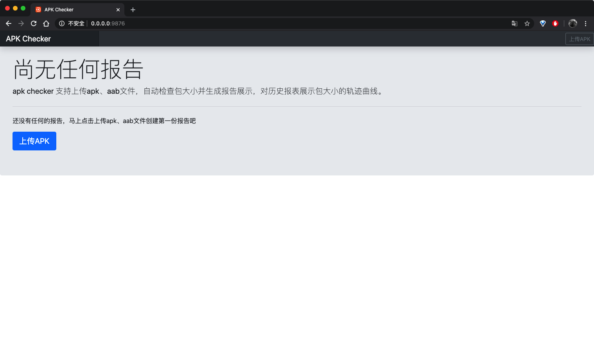
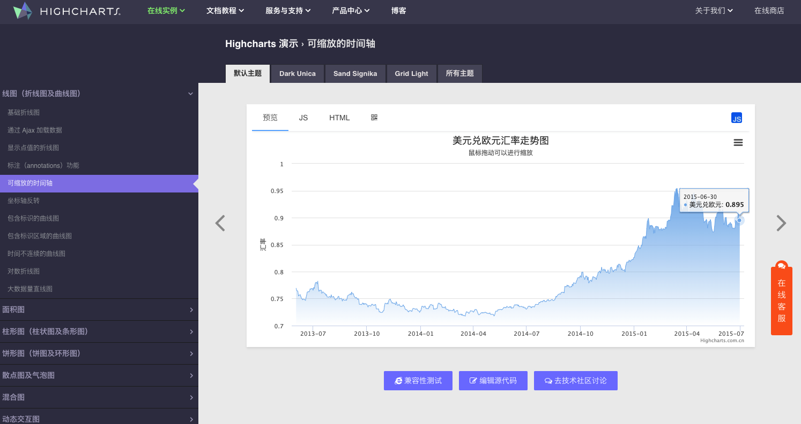
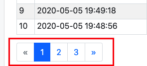

根据@xinxi的[Android 包大小检查测试方案](https://testerhome.com/topics/17629)，增加了android bundle包的检测，和一个web的页面展示。
使用到的工具有：
- [Matrix-APKChecker ](https://github.com/Tencent/matrix/wiki/Matrix-Android-ApkChecker) (下载地址：[matrix-apk-canary-0.6.5.jar](https://jcenter.bintray.com/com/tencent/matrix/matrix-apk-canary/0.6.5/matrix-apk-canary-0.6.5.jar))
- [bundletool ](https://developer.android.com/studio/command-line/bundletool) (下载地址：[bundletool-all-0.15.0.jar](https://github.com/google/bundletool/releases/download/0.15.0/bundletool-all-0.15.0.jar))

基于[Flask](https://flask.palletsprojects.com/en/1.1.x/) 和[Bootstrap](https://v4.bootcss.com/) 优化了报告展示的UI页面。少废话，先看东西。


### 如何运行
> 由于使用到了[matrix-apk-canary-0.6.5.jar](https://jcenter.bintray.com/com/tencent/matrix/matrix-apk-canary/0.6.5/matrix-apk-canary-0.6.5.jar)和 [bundletool-all.jar]()两个jar包，
> 首先要确保java环境已配置正确
1. clone项目到本地
2. 安装python3及相关依赖的库`pip3 install -r requirements.txt`
3. 使用 gunicorn运行
```bash
cd /GitHub/ApkChecker_new
gunicorn -w 4 -b 0.0.0.0:9876 server:app --timeout 300
# 300秒延时等待防止上传apk后，后台处理时长过长的保护性等待，没加可能会导致aab的包处理超时导致报告生成失败
```
###  App Bundle
#### 什么是App Bundle
App Bundle 是一种新的安卓编译打包方式，编译工具可以根据CPU架构类型、屏幕分辨率、语言等维度将一个传统的App 打包成一个App集合；用户下载App时，应用市场会根据终端三种维度的类型提供仅适配此终端的App子集，从而在提供相同业务功能的前提下，节省用户的网络流量与终端设备空间。（文件扩展名为 .aab）
App bundle 是经过签名的二进制文件，可将应用的代码和资源整理到模块中，如下图所示。以蓝色标识的目录（例如 drawable/、values/ 和 lib/ 目录）表示 Google Play 用来为每个模块创建配置 APK 的代码和资源。

更多关于App Bundle的资料可以从查看 [Android App Bundle 简介](https://developer.android.com/guide/app-bundle)
#### 使用 bundletool 命令行工具进行测试
App Bundle的文件扩展名为 .aab，使用`adb install`是没办法直接将应用安装到手机的。Google 提供了[bundletool](https://github.com/google/bundletool/releases/download/0.15.0/bundletool-all-0.15.0.jar) 命令行工具实现aab文件的安装及信息查看。
当 bundletool 根据您的 app bundle 生成 APK 时，它会将这些 APK 纳入到一个名为“APK set archive”的容器中，该容器以 .apks 作为文件扩展名。请使用 `bundletool build-apks` 命令来生成apks
```
java -jar bundletool-all-0.15.0.jar build-apks --bundle=/MyApp/my_app.aab --output=/MyApp/my_app.apks    
```
apks里面的内容如下，不同的app有所不同



由于部分版本(Android 5.0 以下) 不支持app Bundle功能，个别场景我们需要返回全量包，想要完整的apk，可以在上面的命令行后面加上`--mode=universal`的参数就行
```
java -jar bundletool-all-0.15.0.jar build-apks --bundle=/MyApp/my_app.aab --output=/MyApp/my_app.apks --mode=universal
```
apks里面就只有一个完整的universal.apk，解压出来直接`adb install universal.apk `就好啦



生成的apks 安装到android设备上需要执行下面的命令：
```
java -jar bundletool-all-0.15.0.jar  install-apks --apks=/MyApp/my_app.apks
```
估算apks文件实际安装到手机上的apk大小，可以使用下面的命令：
```
java -jar bundletool-all-0.15.0.jar get-size total --apks=/MyApp/my_app.apks
```
更多bundletool的使用说明可以查看：[https://developer.android.com/studio/command-line/bundletool](https://developer.android.com/studio/command-line/bundletool)
### Matrix-APKChecker
[Matrix-ApkChecker](https://jcenter.bintray.com/com/tencent/matrix/matrix-apk-canary/0.6.5/matrix-apk-canary-0.6.5.jar) 是微信针对android安装包的分析检测工具，根据一系列设定好的规则检测apk是否存在特定的问题，并输出较为详细的检测结果报告，用于分析排查问题以及版本追踪。Matrix-ApkChecker以一个jar包的形式提供使用，通过命令行执行 `java -jar ApkChecker.jar`` 即可运行。
简单使用命令如下:
```
java -jar matrix-apk-canary-0.4.10.jar --apk <your_apk_path>
```
使用配置文件命令如下:
```
java -jar matrix-apk-canary-0.4.10.jar -apk <your_apk_path> --config <your_config_path>
```
具体的使用和操作可以查看：[Matrix Android ApkChecker README](https://github.com/Tencent/matrix/wiki/Matrix-Android-ApkChecker)
### APP Bubdle文件如何结合Matrix-APKChecker检查包大小信息
aab文件通过bundletool命令行生成apks后(其实apks就是个压缩文件)，解压后发现里面就是按照相关的逻辑生成了多个apk。google会根据设备的相关配置，安装上对应的apk达到缩小app大小的目的。
由于我测试的app，打包的aab通过bundletool命令行生成apks发现，其实里面就是一个base-master.apk 和另外两个base-arm64_v8a.apk和base-armeabi.apk。后两其实是根据手机是否为64位分出来的两个包，包含了不同的资源。只要知道其大小就好了，我只要用Matrix-APKChecker检查去base-master.apk就可以了。
所以对于App Bundle的aab文件，我处理的方式是
1. 先使用bundletool 生成apks
2. 解压出apks里的多个apk
3. 记录base-arm64_v8a.apk和base-armeabi.apk的文件大小，用Matrix-APKChecker检查去base-master.apk
4. 然后将数据整理以报告的形式展示

### 基于Flask的web页面
上面讲了App Bundle 和Matrix-APKChecker的内容，下面讲解下Web页面是怎么实现的
#### 路由及页面跳转


|route  |  templates  |            
| -------- | -------- |
|  /   |  home.html  |  
|  /&lt;package&gt;  |  dashboard.html、dashboard_aab.html  |
|  /&lt;package&gt;/reports/&lt;report_path&gt;  |  report_template.html、report_template_aab.html  |

#### dashboard页面展示
##### 上传apk
点击上传apk的按钮后，弹出的弹框相关操作使用了Bootstrap的[模态框（Modal）](https://v4.bootcss.com/docs/components/modal/)，判断是否为apk、aab的文件，上传到工程目录下的update文件夹下，执行run，运行生成报告html文件，并弹出alert 提示后自动跳转到详情报告页面。
- - - - - 
*server.py*
```python
@app.route('/upload', methods=['GET', 'POST'])
def upload():
    '''上传apk、aab文件'''
    if request.method == 'GET':
        return "is upload file ... "
    else:
        path = request.form.get('upload_path')
        file = request.files['upload_file']
        file_name = file.filename
        if os.path.splitext(file_name)[-1][1:] not in ['APK', 'apk', 'aab']:
            return jsonify({"code": 200, "info": "文件：%s 不是apk or aab，请重试" % file_name})
        else:
            base_dir = config.tmp_upload_path
            if not os.path.exists(base_dir):
                mk_dir(base_dir)
            base_dir = config.tmp_upload_path
            file.save(os.path.join(base_dir, path, file_name))
            logger.info('上传%s' % file_name)
            report_info = run(os.path.join(base_dir, path, file_name))
            return jsonify({"code": 200, "info": "%s报告生成成功，即将跳转%s" % (file_name, report_info['report_path']),'report_info': report_info})
```
- - - - - 
*home.html、 dashboard.html、 dashboard_aab.html*
```js
$('#upload').click(function() {
    var upload_path = $('#upload_path').text();
    var formData = new FormData($('#upload-form')[0]);
    formData.append("upload_path", upload_path);
    window.alert("文件后台上传处理中,请稍后");
    $.post({
        url: '/upload',
        dataType: 'json',
        type: 'POST',
        data: formData,
        async: true,
        cashe: false,
        contentType: false,
        processData: false,
        success: function(returndata) {
            if (returndata['code'] == 200) {
                var info = returndata['info'];
                alert(info);
                var report_path =returndata['report_info']['report_path'];
                window.location.href = report_path;
            }
        },
        error: function(returndata) {
            alert("报告生成失败！")
        }
    })
});
```
##### 报告统计页面展示
统计页面左侧可以切换不同的apk 包查看相应的包历史大小信息，由于没有使用到数据库，每次生成的html都会保存在Project_path/Report/`<package_name>`/reports的路径下面，并且更新<package_name>文件夹下的`rs.json`文件。 每次的页面加载获取数据都是读取`Project_path/Report/`下的文件目录结构和相应的`rs.json`文件信息后展现出来的。
>- 默认导航栏显示的名称为`Project_path/Report/`下各个`<package_name>`文件夹的名字
>- 想要左侧的导航栏内的不显示packagename而是对应的app名称，可以去`config.py`的`dict internalapp`中填写上自己app的包名和APP名称
> - 同一个包名的，apk和aab会存放在两个文件夹下，aab的包的会自动生成以`_aab`结尾的文件夹

由于apk和aab的数据内容有差别，web页面展示也有所不同，统计页面分别以`dashboard.html、 dashboard_aab.html`模板，要是刚开始没有任何报告的时候(`Project_path/Report/`都还没有的时候)，则以`home.html`为模板展示首页。

- - - - - 
*server.py*
```python
@app.route('/')
@app.route('/<package>')
def statistics(package=None):
    '''模板生成统计报告'''
    folders = get_report_folders()
    if folders:
        if not package:
            package = list(folders.keys())[0]
        else:
            pass
        if not os.path.exists(os.path.join(config.report_folder, package, 'rs.json')):
            pass
        else:
            reports_info = json.loads(read_file(os.path.join(config.report_folder, package, 'rs.json')))
            reports_info['last']['package'] = package
            report_list = reports_info['total']
            script_list = make_script_str(report_list)

            page, per_page, offset = get_page_args(page_parameter="page", per_page_parameter="per_page")
            pagination_users = get_users(report_list, offset=offset, per_page=per_page)
            pagination = Pagination(
                page=page,
                per_page=per_page,
                total=len(report_list),
                record_name="users",
                css_framework="bootstrap4"
            )

            context = {
                'urls': pagination_users,
                'size_list': script_list[1],
                'time_list': script_list[0],
                'package': package,
                'folders': folders,
                'appname': reports_info['last']['appname']
            }

            if 'aab' in package:
                return render_template("dashboard_aab.html", context=context, per_page=per_page, pagination=pagination)
            else:
                return render_template("dashboard.html", context=context, per_page=per_page, pagination=pagination)
    else:
        return render_template("home.html")

```
##### 包打大小曲线图绘制
报告上的折线图是从[Highcharts 演示 › 可缩放的时间轴](https://www.highcharts.com.cn/demo/highcharts/line-time-series)修改而来的，在`dashboard.html、 dashboard_aab.html`内编辑好相应html和js代码后，传入的数据为apk的大小及报告的创建时间，都是在`rs.json`中已经生成保存好了的。
详情报告页面的，饼图也是用的[Highcharts 演示 › 基础饼图](https://www.highcharts.com.cn/demo/highcharts/pie-basic)。

这个网站提供了丰富的报表展示效果，支持在线编辑和调试，提供多种主题的选择。

##### 表格及分页
每个包大小详情的基本数据组成的表格在web页面展示，内容传入也都是在rs.json的`total`中已经保存好了的。只需要将数据传入就行
- - - - - 
**dashboard.html**
```html
<div class="table-responsive">
          <table class="table table-striped table-sm table-bordered">
            <thead class="table-dark">
              <tr>
                <th>#</th>
                <th>创建时间</th>
                <th>APP版本</th>
                <th>versioncode</th>
                <th>包体大小</th>
                <th>详情</th>
              </tr>
            </thead>
            <tbody>
              <!--这里写for开头-->
              <!---->
              <tr>
                  <td>{{ loop.index + pagination.skip }}</td>
                  <td class="text-left">{{ url['create_time'] }}</td>
                  <td class="text-left">{{ url['versionName'] }}</td>
                  <td class="text-left">{{ url['versionCode'] }}</td>
                  <td class="text-left">{{ url['apksize'] }}</td>
                  <td><a href="{{ url['report_path'] }}"><span style="color: #0077FF;">查看详情</span></a></td>
              </tr>
              <!---->
              <!--这里写for结束-->
            </tbody>
          </table>
        </div>
        {{ pagination.links }}
```

表格要是数据很多，在一个页面展示就会显得页面很长，因此需要对表格进行分页切换的处理。就是这个东西

Google了一下发现flask有相应的模块，就直接哪来用就是了。[Flask-paginate/](https://pythonhosted.org/Flask-paginate/)
- - - - - 
**python**

```python
from flask_paginate import Pagination, get_page_args
from flask import render_template

def get_users(users,offset=0, per_page=10):
    return users[offset: offset + per_page]

@app.route('/')
def pages():
    page, per_page, offset = get_page_args(page_parameter="page", per_page_parameter="per_page")
    users = [{"create_time": "2020-05-05 19:52:32","size": "39.23"},     
             {"create_time": "2020-05-06 19:52:32","size": "39.23"},
                    ...
                    ...
            ]    
    pagination_users = get_users(users,offset=offset, per_page=per_page)
    pagination = Pagination(
        page=page,
        per_page=per_page,
        total=len(users),
        record_name="users",
        css_framework="bootstrap4"
    )
    return render_template('index.html', users=pagination_users, per_page=per_page, pagination=pagination)
if __name__ == '__main__':
    app.run(host='0.0.0.0', port=9876, debug=True)
```
**index.html**
```html
{{ pagination.info }}
{{ pagination.links }}
<table class="table table-striped table-sm table-bordered">
  <thead>
    <tr>
      <th>#</th>
      <th>创建时间</th>
      <th>包体大小</th>
    </tr>
  </thead>
  <tbody>
      
      <tr>
          <td>{{ loop.index + pagination.skip }}</td>
          <td class="text-left">{{ url['create_time'] }}</td>
          <td class="text-left">{{ url['size'] }}</td>
      </tr>
      

  </tbody>
</table>
{{ pagination.links }}
```
#### 页面的UI优化
页面很多是表格的展示，因为是基于和[Bootstrap](https://v4.bootcss.com/) 的，所以根据[Bootstrap-Tables配置文档](https://v4.bootcss.com/docs/content/tables/)对模板html进行相关的修改就可以展现较为美观的页面了。
例如想把表格展示位黑的 ，加上`class="table-dark"` 就好了。


